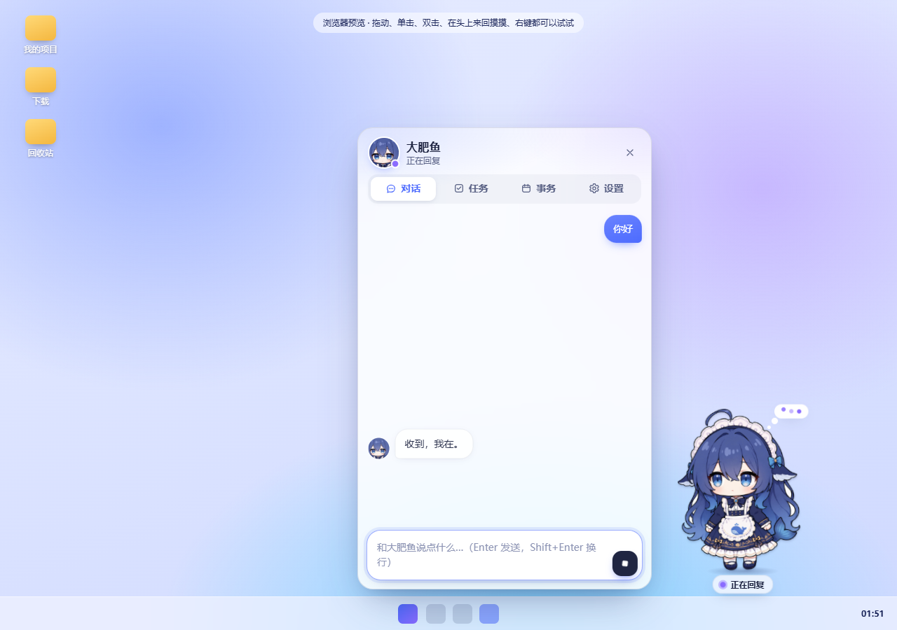
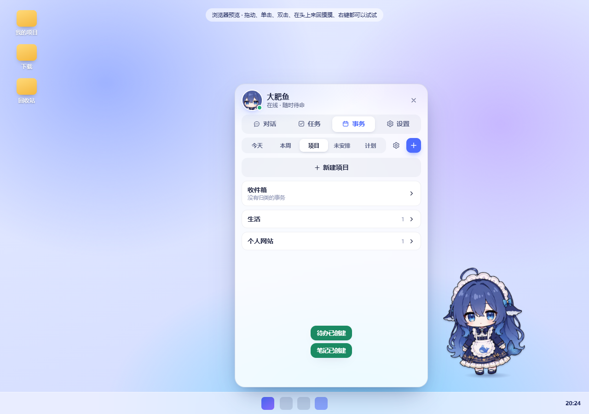
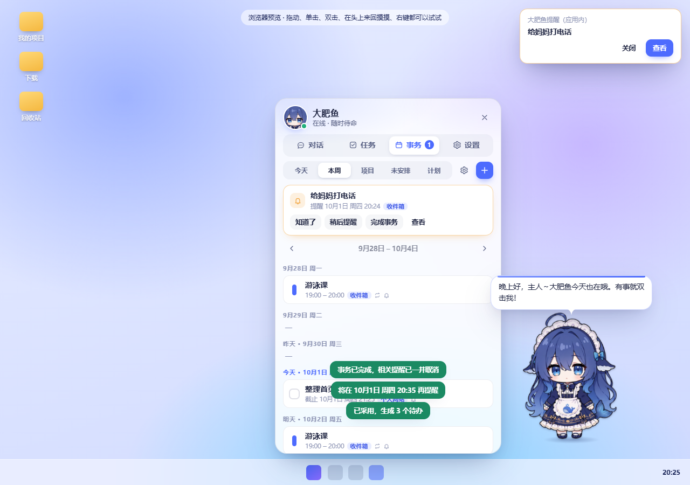
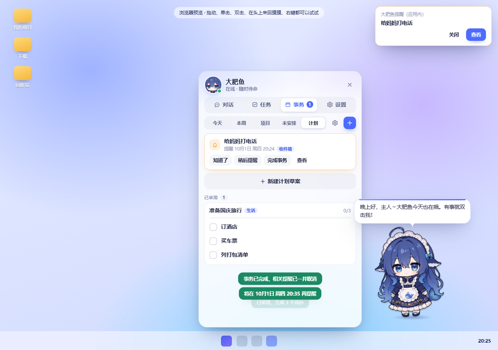
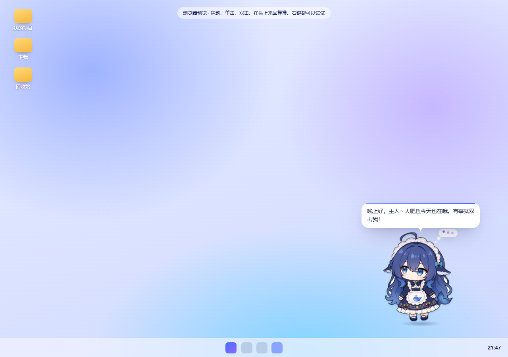

# 大肥鱼管家

[](https://github.com/SatakaGintoki/zhuochong/actions/workflows/verify.yml) · [下载预览版](https://github.com/SatakaGintoki/zhuochong/releases) · [反馈问题](https://github.com/SatakaGintoki/zhuochong/issues/new/choose)

一只常驻桌面的蓝色小鲸鱼，也是你的 AI 工作与日常事务搭档。用聊天记录待办和提醒，把编码交给本机执行器，随时查看进度，失败后沿原任务继续。



*界面预览使用隔离演示数据，展示桌宠与聊天面板。*

源码版本 **0.2.13 · 开发中**，当前可下载版本为 **0.2.12 · 早期预览**。[下载 Windows x64 预览版](https://github.com/SatakaGintoki/zhuochong/releases/tag/v0.2.12)。提供压缩包，解压全部文件后运行“大肥鱼管家.exe”；不是安装器，也未签名。不需要另装 Node.js；真实工作仍需个人模型凭据与已登录的执行器。

若 Windows 阻止启动，请查看系统提示和来源信息；不要关闭系统保护。尚无正式稳定版，已知限制见下文及发行说明。

## 能做什么

- 常驻置顶桌宠、眨眼/点头/思考表情、短对话、托盘召回和专注模式。
- 聊天和任务结果支持 Markdown 标题、表格、列表和代码块；直连支持流式文字。
- 通过 DeepSeek 理解需求，调用已安装的 Codex、Claude Code 或 ZCode。
- 查看后台任务状态、结果、错误及文件变化，支持取消、超时和中断续做。
- Claude 优先恢复保存的会话；旧任务可从已有文件和日志继续，保留原任务 ID。
- 通用事务项目、待办、日程、笔记和确认后执行的学习/工作计划。
- 重复日程、时区、桌面提醒、免打扰和稍后提醒，重启后补查。
- 编码项目、模板、显式偏好与有限范围文件检查点。

适合已使用 AI 编程工具的学生和个人开发者。桌宠是入口，任务管理与可恢复执行是主要工作流。

## 界面演示

以下截图来自浏览器预览与隔离演示数据，不含真实聊天记录或模型凭据。浏览器中的桌面背景、文件夹和任务栏用于模拟展示；原生 Electron 的透明窗口、置顶与系统通知需要在 Windows 中体验。

### 按项目整理事务

把生活、课程、个人网站等分别建成项目，集中管理各自的待办、日程和笔记。还没想好分类的事项可以先放进收件箱，之后再整理。



### 看这一周，处理到期提醒

每周视图把日程和待办按日期排列。提醒到期后，可以选择“知道了”“稍后提醒”或“完成事务”。截图右上角展示的是应用内提醒；安装版还支持桌面通知。



### 确认后，把计划变成待办

需要规划时再让管家帮忙拆解。先查看计划草案，确认采用后生成待办，并逐项完成。学习复习、项目开发、旅行准备都可以使用同一套事务项目。



### 桌宠也会思考

目前接入了眨眼、点头和思考三组逐帧表情，配合桌宠动作与气泡。下面是思考状态的静态截图；实际运行时会播放动画。



## 可以这样和她说

| 场景 | 示例 |
| --- | --- |
| 记录待办 | “在个人网站项目里记一项：整理首页文案。” |
| 设置提醒 | “周五交数据结构作业，周四晚上八点提醒我。” |
| 制定计划 | “帮我把这周的复习拆成一个计划，先给我看，确认后再加入待办。” |
| 查询事务 | “这周有哪些事情还没完成？” |
| 派发编码任务 | “在选好的项目中实现一个贪吃蛇，完成后说明怎么运行。” |
| 继续中断任务 | “刚才失败的任务，从已有文件继续。” |

记录事务、设置提醒和查看日程由管家自身的工具处理；需要操作代码项目时，再派给本机执行器。实际执行取决于模型配置、执行器和权限，示例不代表无需配置即可完成。

## 下载后怎样使用

1. 从 [Releases](https://github.com/SatakaGintoki/zhuochong/releases/tag/v0.2.12) 下载 `Dafeiyu-0.2.12-windows-x64.zip`，完整解压到独立文件夹，运行“大肥鱼管家.exe”。发行包自带后端和 Node.js。
2. 双击角色打开面板，在设置中选择“演示”，无需 API Key 即可体验队列；演示不会实际写代码。
3. 真实聊天配置个人 DeepSeek API Key；编码任务另外需要安装并登录 Codex、Claude Code 或 ZCode 中的一个。日常事务使用管家自身工具。

例如：“周五交数据结构作业，周四晚上八点提醒我”“在这个项目中实现一个贪吃蛇”“刚才失败的任务，从已有文件继续”。

“直连管家”支持逐字流式回复；“Harness 管家”使用官方 SDK，目前显示阶段进度并在结束后展示全文。应用退出或电脑关机期间不能即时提醒，重启后补查。

源码中的 0.2.13 新增可编辑项目记忆、事务指代查询和首次使用引导，尚未打包为发行版。使用说明见 [个人事务工作流](docs/personal-workflow.md)。

## 从源码开发

需要 Windows、Git、Node.js 24 和 npm。在**仓库根目录**打开 PowerShell：

```powershell
npm ci
npm --prefix desktop ci
npm run check
npm --prefix desktop run check
npm start
```

保持后端终端运行，在第二个终端的仓库根目录执行：

```powershell
npm --prefix desktop start
```

Electron 二进制缺失时执行 `node desktop/node_modules/electron/install.js` 后重试。依赖下载需要联网。

**不花模型额度试用：** 双击角色打开面板，在设置中选择“演示”并保存。到任务页新建任务，执行器选择“演示”，填写“验证队列”。结束后应看到结果，但不会修改项目或调用模型。退出重开后，任务记录应仍存在。

**开始真实工作：** 设置中填写自己的 DeepSeek API Key，选择“直连管家”，指定测试项目目录，并选择已安装、登录的执行器。只需安装你要用的执行器。先尝试“只阅读项目并简短说明结构，不修改文件”。

本地检查只证明配置或程序路径可用，不代表账号、额度和权限通过。模型与执行器费用由各自服务收取。

## 出错时

| 现象 | 下一步 |
| --- | --- |
| 模型请求失败 | 检查 Key、地址、模型 ID 和额度；不要把 Key 发到 Issue |
| 找不到执行器 | 安装并登录 CLI，或设置程序绝对路径 |
| Claude permission denied | 查看日志里的权限模式和被拒工具，检查 CLI/项目/组织策略 |
| 任务失败或中断 | 处理错误后点“继续任务”；会话不可用时选“从文件继续” |
| 桌宠看不到 | 单击托盘图标召回，检查置顶开关；专注模式不取消桌宠置顶 |

继续任务保留原 ID、产物和失败历史，不保证外部操作可幂等重放。文件恢复生成副本，不覆盖项目。详见[任务续做](docs/task-resume.md)。

## 权限、数据与限制

- 默认 API 直连，Harness 可选；两者均可派发任务，演示模式不调用模型。
- Claude 默认仅允许文件工具；完全访问需显式开启，仍可能受 CLI 或组织策略限制。目录校验不是操作系统沙箱。
- 成功状态表示执行器报告成功并正常退出，不是独立证明业务目标完成。
- 编码任务队列串行，管家同时回复一条对话。日程和本地提醒已支持；语音、费用预算和其他执行器的原生会话恢复仍待完善。
- 凭据暂存在本地文件，尚未迁移到系统凭据保险库。聊天、检查点和任务结果也可能含私人数据。
- 开发数据在 `.data/`；安装版数据在 `%APPDATA%/dayu-desktop-pet/`。不要上传。开发版前后端分别退出；安装版退出会停止自己管理的后端和任务。
- Windows 是当前验证平台；浏览器预览不能代替原生窗口验收。签名、包体和稳定分发仍需完善。

## 开发与验收

```powershell
npm run check
npm run check:repository
npm --prefix desktop run check
npm --prefix desktop run test:desktop
npm run docs
```

Windows CI 从锁文件安装依赖并运行后端、前端及真实 Electron 隔离验收。纯文档提交不运行桌面测试；分支代码改动和 Pull Request 会运行，手动触发也可用。实时模型测试不属于 CI。收到失败邮件时查看[自动检查说明](docs/GITHUB-ACTIONS.md)。

[架构](docs/ARCHITECTURE.md) · [OpenAPI](docs/openapi.json) · [前端开发](desktop/README.md) · [发布门槛](docs/PUBLIC-PREVIEW.md) · [版本记录](CHANGELOG.md) · [后续计划](docs/ROADMAP.md)

## 许可与素材

代码与原创文档采用 [MIT 许可证](LICENSE)。角色素材包含开源同人立绘和作者自行使用 AI 生成的表情帧，来源与许可范围见 [素材说明](desktop/assets/CREDITS.md)。第三方素材保留原许可。本项目为非官方爱好者作品，与 DeepSeek 无关联。
